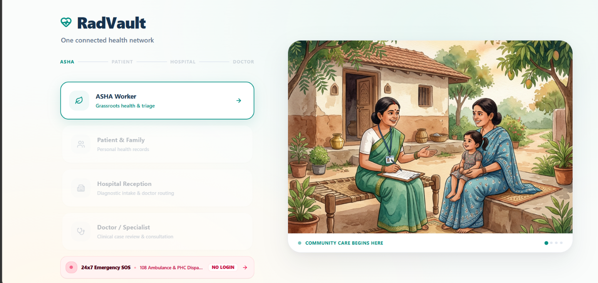
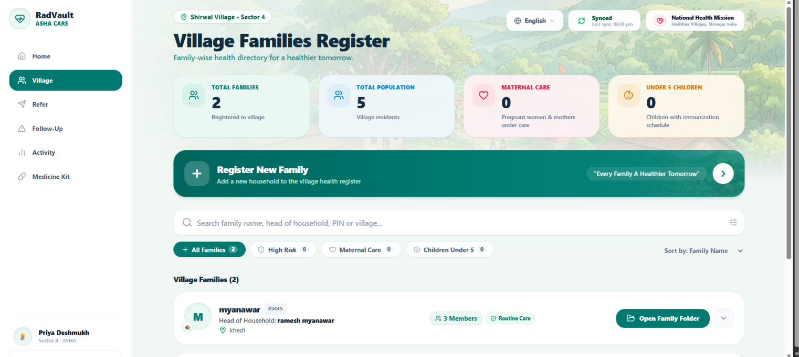
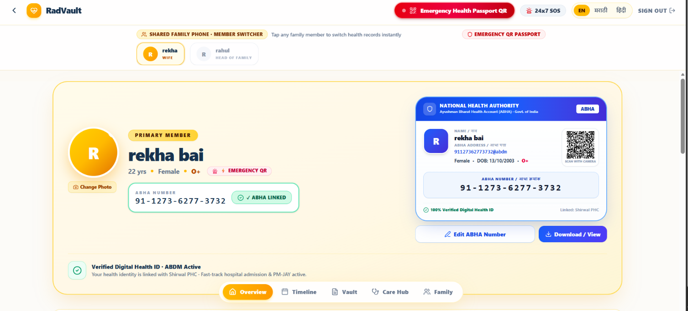
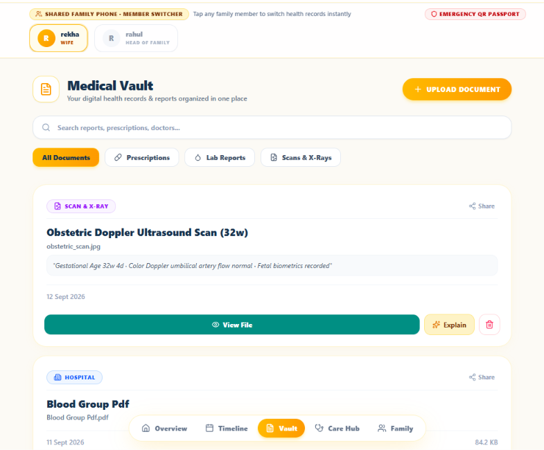
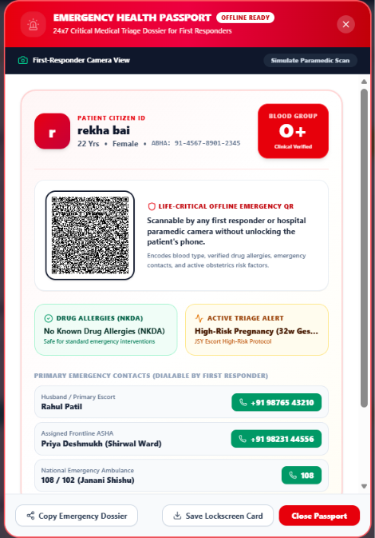
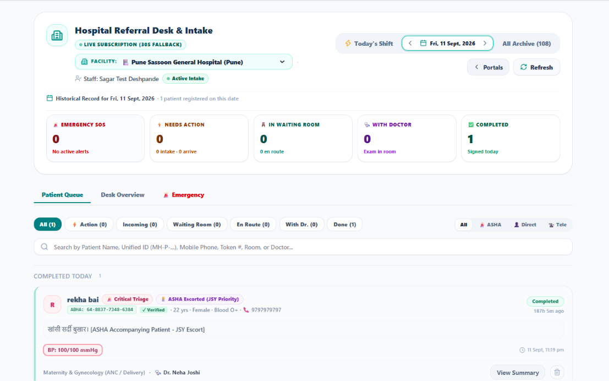
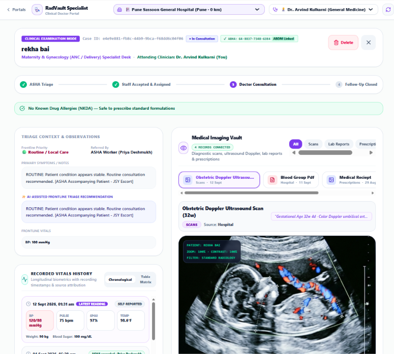

# 🏥 RadVault — Universal Connected Healthcare Platform

> **"One Patient. One Connected Health Journey."**  
> *Consent-driven medical record continuity, ASHA grassroots triage, digital health vault, and tele-radiology consultation platform for rural and underserved communities.*

[](https://radvault.vercel.app)
[](https://radvault.vercel.app)

🌐 **Live Application**: **[https://radvault.vercel.app](https://radvault.vercel.app)**

---



---

## 📌 What is RadVault?

**RadVault** is an end-to-end connected healthcare ecosystem designed for rural and tier-2/3 regions. It bridges rural health workers (**ASHAs / PHCs**), patients, hospital receptionists, and urban medical specialists (**Doctors / Radiologists**) around a **Unified Patient & ABHA ID**.

### ❌ The Rural Healthcare Problem:
* **Fragmented Paper Records**: Patients carry paper files, X-ray films, and CDs across cities—often losing critical history.
* **Specialist Shortages**: Rural primary health centers lack full-time radiologists and medical specialists.
* **Duplicate Diagnostic Tests**: Inaccessible medical history leads to repeated, expensive X-rays and scans.
* **Emergency Delays**: Paramedics at accident sites lack instant access to blood groups, allergies, or health records.

### ✅ How RadVault Solves It:
RadVault connects every stage of patient care into a single, synchronized digital pipeline—ensuring medical records follow the patient wherever they go.

---

## 🔄 End-to-End Care Workflow

RadVault connects 6 key stages in a patient's healthcare journey:

```
┌───────────────────────────┐      ┌───────────────────────────┐      ┌───────────────────────────┐
│  STEP 1: VILLAGE TRIAGE   │ ───► │   STEP 2: PATIENT VAULT   │ ───► │  STEP 3: RADIOLOGY VAULT  │
│ ASHA Worker Registration  │      │  ABHA ID & Vitals Track   │      │ Scan & Diagnostic Reports │
└───────────────────────────┘      └───────────────────────────┘      └───────────────────────────┘
                                                                                    │
                                                                                    ▼
┌───────────────────────────┐      ┌───────────────────────────┐      ┌───────────────────────────┐
│  STEP 6: SPECIALIST CARE  │ ◄─── │  STEP 5: HOSPITAL INTAKE  │ ◄─── │  STEP 4: EMERGENCY SOS    │
│ Tele-Radiology Review     │      │ Reception Queue & Triage  │      │ Zero-Login Ambulance QR   │
└───────────────────────────┘      └───────────────────────────┘      └───────────────────────────┘
```

---

## 🚀 Interactive Workflow Walkthrough

### 👩‍⚕️ Step 1: ASHA Worker Grassroots Portal
Empowers frontline health workers to register families, capture vital telemetry, and log routine village visits.



* **Village Household Registry**: Manage families and patient profiles in rural villages like *Vadgaon*.
* **Digital Patient Registration**: Onboard new patients and automatically link ABHA health numbers.
* **Field Vitals Telemetry**: Capture Blood Pressure, Heart Rate, SpO2, Temperature, and Pregnancy milestones.
* **Medicine Kit Tracker**: Log distributions of essential village health supplies (ORST, Paracetamol, Iron Folic Acid).

---

### 👨‍👩‍👧 Step 2: Patient & Family Health Portal
A central health hub allowing patients and family members to access their ABHA health card, vitals trends, and care history.



* **Family Member Switcher**: Switch health profiles across household members (spouses, children, elders).
* **ABHA Digital Health Card**: Access instant digital ABHA QR codes for hospital check-in.
* **Vitals Telemetry Monitor**: Track historical vitals trends with high-contrast indicator cards.
* **Government Scheme Finder**: Automated eligibility matching for *Ayushman Bharat (PM-JAY)* benefits.

---

### 📁 Step 3: Medical Records & Radiology Vault
A secure digital vault for storing X-rays, CT/MRI scans, lab reports, and doctor prescriptions.



* **Multi-Modality Organization**: Filter records by *Radiology (X-Ray/CT/MRI)*, *Lab Reports*, or *Prescriptions*.
* **Interactive Scan Viewer**: High-resolution DICOM/image viewer with contrast inversion tools for detailed examination.
* **Clinical Diagnostic Reports**: View signed doctor impressions alongside diagnostic images.

---

### 🚨 Step 4: 24x7 Emergency SOS & Health Passport
A public, zero-login emergency interface built for trauma victims and 108 ambulance first-responders.



* **Zero-Login Emergency Dispatch**: Request immediate 108 Ambulance dispatch and notify local PHCs without logging in.
* **Break-Glass Emergency Profile**: Instantly reveal critical blood group, allergies (e.g., *Penicillin*), and emergency contacts.
* **Scannable Emergency QR Code**: Paramedics scan the QR code to read emergency details directly on mobile phones.

---

### 🏥 Step 5: Hospital Reception & Intake Desk
Streamlines patient intake, ABHA scanning, and doctor routing at primary health centers and hospitals.



* **ABHA Quick Intake**: Fast patient lookup via ABHA QR code scan or name search.
* **Triage Categorization**: Priority queue tagging (*Emergency*, *Urgent*, *Routine*).
* **Doctor Queue Assignment**: Assign waiting patients directly to available consulting physicians.

---

### 🩺 Step 6: Specialist Doctor & Tele-Radiology Workspace
A clinical workspace for consulting physicians and remote radiologists to review cases, examine scans, and write e-prescriptions.



* **Clinical Case Review**: Access patient history, timeline events, and previous vitals.
* **Tele-Radiology Inspection**: Inspect full-resolution diagnostic imaging scans with zoom and adjustment controls.
* **Digital Prescription & Referral**: Issue digital prescriptions and record diagnostic recommendations.

---

## ⚡ Quick Start & Live Application

### 🌐 Instant Live Access (No Setup Required)
Test the live production deployment directly in your browser:  
👉 **[https://radvault.vercel.app](https://radvault.vercel.app)**

---

### 💻 Run Locally
```bash
# Clone the repository
git clone https://github.com/sarthakkharade903-tech/RadVault.git

# Navigate to project folder
cd RadVault

# Install dependencies
npm install
```

### 2. Run Application
```bash
npm run dev
```

Open your browser at **`http://localhost:5173/`**.

> 💡 *Note: You can toggle between **Demo Mode** (offline sample data) and **Live Supabase DB** anytime using the top navigation bar.*

---

## 🛠️ Tech Stack & Database Schema

| Layer | Technology |
| :--- | :--- |
| **Frontend** | React 19, Vite 8, Tailwind CSS v4 |
| **Icons & Design** | Lucide React, Custom Healthcare UI Theme |
| **Database Engine** | Dual Engine: Supabase PostgreSQL + Offline Mock Engine |
| **Security & RLS** | Row Level Security (RLS) on `patients`, `vitals`, `health_records`, `referrals` |

```
                        ┌─────────────────────────┐
                        │     families table      │
                        └────────────┬────────────┘
                                     │ 1:N
                        ┌────────────▼────────────┐
                        │     patients table      │
                        │ (unified_id / abha_id)  │
                        └────────────┬────────────┘
                                     │ 1:N
     ┌─────────────────┬─────────────┼─────────────┬─────────────────┐
     ▼                 ▼             ▼             ▼                 ▼
┌─────────┐      ┌───────────┐  ┌───────────┐  ┌───────────┐   ┌──────────────┐
│ vitals  │      │  health_  │  │ referrals │  │ appoint-  │   │ asha_visit_  │
│         │      │  records  │  │           │  │ ments     │   │    logs      │
└─────────┘      └───────────┘  └───────────┘  └───────────┘   └──────────────┘
```

---

## 📜 License & Team

Built for connected health continuity, rural accessibility, and hackathon presentation.  
Developed by **Team RadVault**.
