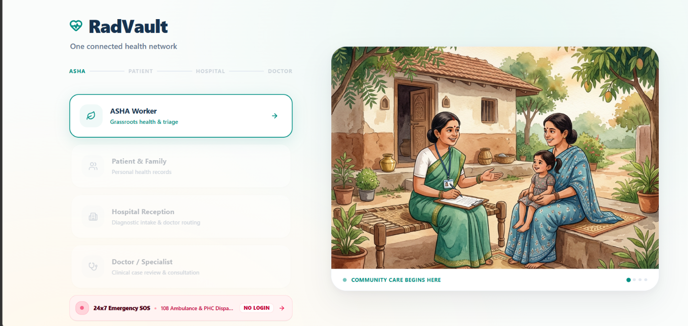
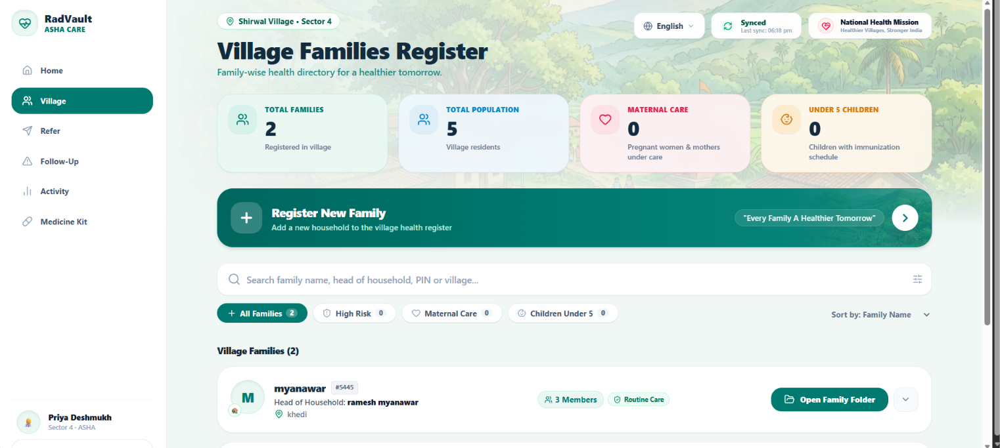
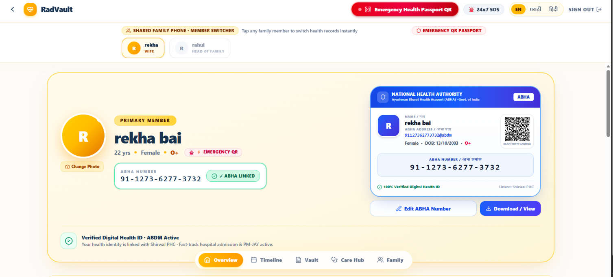
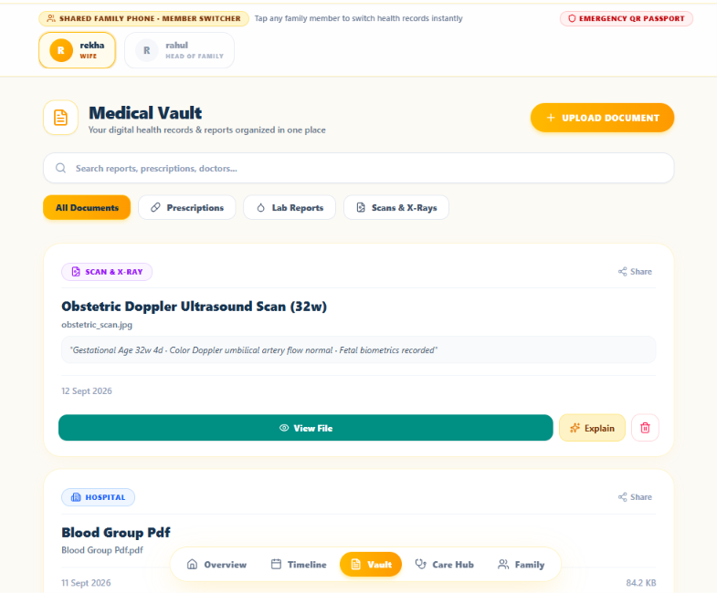
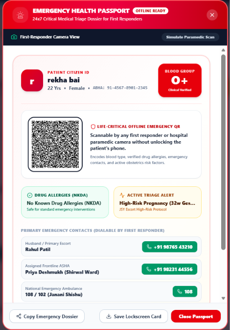
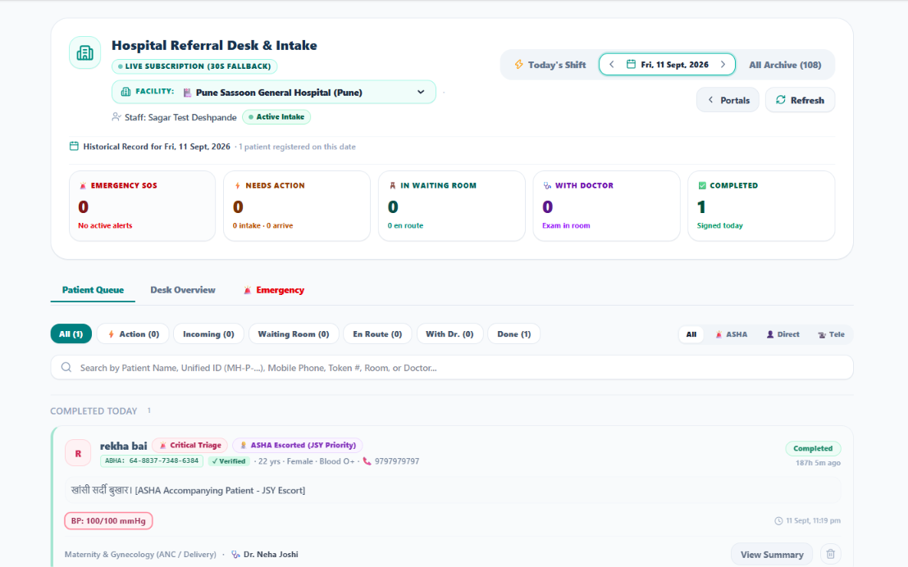
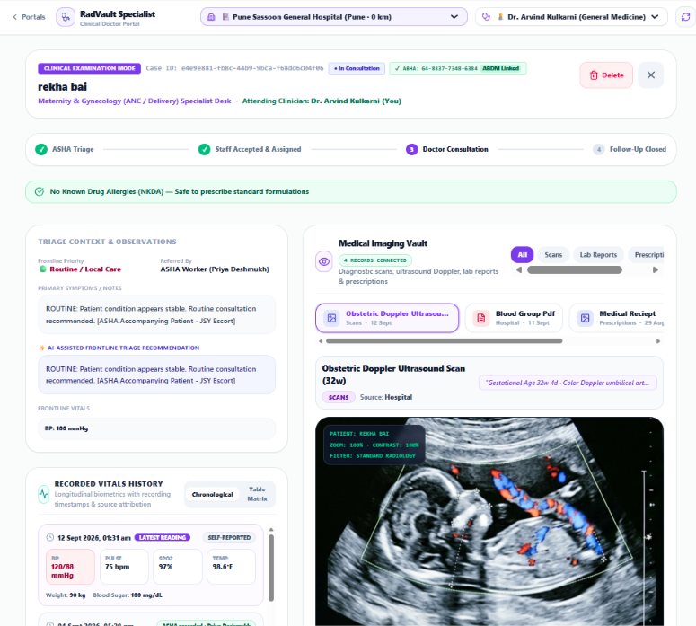

# 🏥 RadVault — Universal Connected Healthcare & Disease Surveillance Platform

> **"One Patient. One Connected Health Journey. Zero-PII Population Surveillance."**  
> *A unified digital health platform combining consent-driven longitudinal medical records, ASHA grassroots triage, break-glass emergency QR passports, tele-radiology consultation, and real-time public health disease trend surveillance.*

[](https://radvault.vercel.app)
[](https://radvault.vercel.app)

🌐 **Live Application**: **[https://radvault.vercel.app](https://radvault.vercel.app)**

---



---

## 📌 What is RadVault?

**RadVault** is an end-to-end connected healthcare and epidemiological surveillance platform designed for rural and tier-2/3 regional health networks. It bridges frontline rural health workers (**ASHAs**), primary health centers (**PHCs**), hospital receptionists, urban medical specialists (**Doctors/Radiologists**), and District Health Officers (**DHOs**) around a **Unified Patient & ABHA ID**.

### ❌ The Regional Healthcare Challenge:
* **Fragmented Paper Records**: Patients carry paper files and X-ray films between clinics—often losing critical medical history.
* **Specialist Shortages**: Rural primary health centers lack full-time radiologists and consulting specialists.
* **Emergency Response Gaps**: First-responders at accident sites lack instant access to blood groups, allergies, or chronic illness history.
* **Delayed Outbreak Intelligence**: Public health administrators lack real-time aggregate disease velocity data from grassroots consultations.

### ✅ How RadVault Solves It:
RadVault connects every stage of patient care into a single, synchronized digital pipeline—ensuring medical records follow the patient seamlessly while clinical events feed de-identified aggregate signals into real-time epidemiological monitoring.

---

## 🔄 End-to-End Care & Surveillance Architecture

```
┌───────────────────────────┐      ┌───────────────────────────┐      ┌───────────────────────────┐
│  STEP 1: VILLAGE TRIAGE   │ ───► │   STEP 2: PATIENT VAULT   │ ───► │  STEP 3: RADIOLOGY VAULT  │
│ ASHA Worker Registration  │      │  ABHA ID & Vitals Track   │      │ Scan & Diagnostic Reports │
└───────────────────────────┘      └───────────────────────────┘      └───────────────────────────┘
                                                                                    │
                                                                                    ▼
┌───────────────────────────┐      ┌───────────────────────────┐      ┌───────────────────────────┐
│ STEP 7: DHO SURVEILLANCE  │ ◄─── │  STEP 6: SPECIALIST CARE  │ ◄─── │  STEP 5: HOSPITAL INTAKE  │
│ OpenStreetMap Epi Engine  │      │ Tele-Radiology Review     │      │ Reception Queue & Triage  │
└───────────────────────────┘      └───────────────────────────┘      └───────────────────────────┘
```

---

## 🚀 Architectural Feature Walkthrough

### 👩‍⚕️ Step 1: ASHA Worker Grassroots Portal
Empowers frontline health workers to register rural households, capture vital telemetry, and log routine village visits.



* **Village Household Registry**: Manage family units and patient profiles across rural village clusters.
* **Digital Patient Registration**: Onboard new patients and automatically link ABHA health ID numbers.
* **Field Vitals Telemetry**: Capture Blood Pressure, Heart Rate, SpO2, Temperature, and Pregnancy milestones.
* **Essential Supply Tracker**: Log distribution of essential village health kits (ORST, Paracetamol, Iron Folic Acid).

---

### 👨‍👩‍👧 Step 2: Patient & Family Health Portal
A central health hub allowing patients and family members to access their ABHA health card, vitals trends, and care history.



* **Family Profile Switcher**: Instantly switch health profiles across household members (spouses, children, elders).
* **ABHA Digital Health Card**: Access digital ABHA QR codes for clinic check-in.
* **Vitals Telemetry Monitor**: Track historical vitals trends with high-contrast indicator cards.
* **Government Scheme Matcher**: Automated eligibility verification for *Ayushman Bharat (PM-JAY)* benefits.

---

### 📁 Step 3: Medical Records & Radiology Vault
A secure digital vault for storing X-rays, CT/MRI scans, lab reports, and doctor prescriptions.



* **Multi-Modality Organization**: Filter records by *Radiology (X-Ray/CT/MRI)*, *Lab Reports*, or *Prescriptions*.
* **Interactive Scan Viewer**: High-resolution viewer with contrast inversion tools for detailed diagnostic examination.
* **Clinical Diagnostic Reports**: View signed doctor impressions alongside high-res scan images.

---

### 🚨 Step 4: 24x7 Emergency SOS & Health Passport
A public, zero-login emergency interface built for trauma victims and 108 ambulance first-responders.



* **Zero-Login Emergency Dispatch**: Request immediate 108 Ambulance dispatch and notify local PHCs without logging in.
* **Break-Glass Emergency Profile**: Instantly reveal critical blood group, allergies (e.g., *Penicillin*), and emergency contacts.
* **Scannable Emergency QR Code**: Paramedics scan the QR code to read longitudinal emergency details directly on mobile devices.

---

### 🏥 Step 5: Hospital Reception & Intake Desk
Streamlines patient intake, ABHA scanning, and doctor routing at primary health centers and hospitals.



* **ABHA Quick Intake**: Fast patient lookup via ABHA QR code scan or name search.
* **Triage Categorization**: Priority queue tagging (*Emergency*, *Urgent*, *Routine*).
* **Doctor Queue Assignment**: Assign waiting patients directly to available consulting physicians.

---

### 🩺 Step 6: Specialist Doctor & Tele-Radiology Workspace
A clinical workspace for consulting physicians and remote radiologists to review cases, examine scans, and write e-prescriptions.



* **Clinical Case Review**: Access patient history, timeline events, and previous vitals.
* **Tele-Radiology Inspection**: Inspect full-resolution diagnostic imaging scans with zoom and contrast adjustment controls.
* **Digital Prescription & Referral**: Issue digital prescriptions and record diagnostic recommendations.

---

### 🛡️ Step 7: Public Health DHO Surveillance & Outbreak Analytics
A high-level command center for District Health Officers (DHO) and epidemiologists to monitor disease incidence trends, statistical outbreak velocities, and containment dispatch.

* **OpenStreetMap GIS Cartography**: Interactive Pune District vector map with taluka-level clustering (Baramati, Haveli, Bhor, Daund, etc.) and visual hotspot radar animations.
* **Algorithmic Outbreak Velocity Alerts**: Automatic detection of statistical anomalies (e.g., *+142% Dengue Spike Velocity in Baramati Taluka*) with rapid response team dispatch integration.
* **Mathematical $k$-Anonymity Protection ($k \ge 5$)**: Rural sub-center clusters recording fewer than 5 cases are strictly masked (`< 5 cases (Suppressed)`) to mathematically prevent patient re-identification.
* **Provable Zero-PII Data Isolation**: Administrator view consumes strictly de-identified aggregate feeds—names, phone numbers, and ABHA IDs are completely stripped at data ingestion.

---

## ⚡ Quick Start & Live Application

### 🌐 Instant Live Access (No Setup Required)
Test the live production deployment directly in your browser:  
👉 **[https://radvault.vercel.app](https://radvault.vercel.app)**

---

### 💻 Run Locally
```bash
# Clone the repository
git clone https://github.com/sarthakkharade903-tech/RadVault.git

# Navigate to project folder
cd RadVault

# Install dependencies
npm install

# Run dev server
npm run dev
```

Open your browser at **`http://localhost:5173/`**.

> 💡 *Note: You can toggle between **Demo Mode** (offline sample data) and **Live Supabase DB** anytime using the top navigation bar.*

---

## 🛠️ Tech Stack & Database Architecture

| Layer | Technology |
| :--- | :--- |
| **Frontend Framework** | React 19, Vite 8, Tailwind CSS v4 |
| **GIS Mapping** | Leaflet.js, OpenStreetMap Standard Tiles |
| **Icons & Design** | Lucide React, Custom Healthcare UI Theme |
| **Database Engine** | Dual Engine: Supabase PostgreSQL + Offline Mock Engine |
| **Security & RLS** | Row Level Security (RLS) on `patients`, `vitals`, `health_records`, `referrals` |

```
                        ┌─────────────────────────┐
                        │     families table      │
                        └────────────┬────────────┘
                                     │ 1:N
                        ┌────────────▼────────────┐
                        │     patients table      │
                        │ (unified_id / abha_id)  │
                        └────────────┬────────────┘
                                     │ 1:N
     ┌─────────────────┬─────────────┼─────────────┬─────────────────┐
     ▼                 ▼             ▼             ▼                 ▼
┌─────────┐      ┌───────────┐  ┌───────────┐  ┌───────────┐   ┌──────────────┐
│ vitals  │      │  health_  │  │ referrals │  │ appointments│   │ asha_visit_  │
│         │      │  records  │  │           │  │             │   │    logs      │
└─────────┘      └───────────┘  └───────────┘  └───────────┘   └──────────────┘
```

---

## 📜 License & Team

Built for connected health record continuity, emergency QR passports, and population health surveillance.  
Developed by **Team RadVault**.
